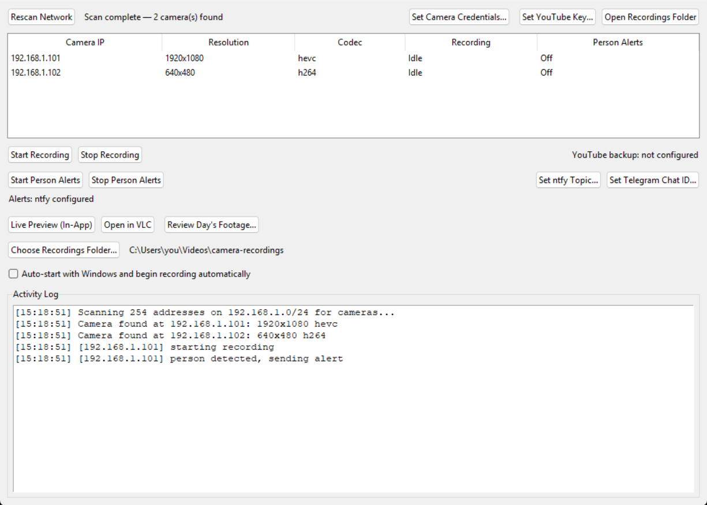

# V380 Smart Camera Recorder

A self-hosted alternative to a cheap IP camera's paid cloud subscription: local recording,
AI person-detection alerts to your phone, and full control of your own footage — no monthly
fee, no vendor cloud, no dependency on the camera manufacturer staying in business.

Built around a Windows desktop app (`app.py`) that auto-discovers RTSP-capable cameras on your
LAN and gives you recording, live preview, and smart alerts through one GUI — no terminal
required day-to-day.



*(Camera IPs/data shown are illustrative, not a real deployment.)*

---

## Why this exists

Cheap consumer WiFi cameras (V380, and many similar white-label OEM cameras) usually offer
"smart" features — motion alarms, AI event detection, cloud storage — but gate almost all of it
behind a recurring subscription, and even paid, your video is processed and stored on **their**
servers, not yours.

This project does the same job without any of that:

- **Free forever** — no subscription, ever.
- **Fully private** — video never leaves your network, except the specific alert photo you
  choose to send to your own phone.
- **Fully customizable** — build exactly the alerting/logging logic you want (this repo
  includes a phone-alert pipeline and a foundation for face-recognition + attendance logging,
  see Roadmap).
- **No vendor lock-in** — if the camera maker shuts down, changes pricing, or drops support,
  none of this breaks. It only depends on the camera speaking standard RTSP.

## How it works

Cheap cameras like this have no spare onboard compute for AI (no NPU) and run closed,
unmodifiable firmware — there's no way to "program the camera" directly. So the architecture
here is the same one every serious self-hosted camera system uses (Frigate, Blue Iris,
ZoneMinder, etc.): the camera stays a **dumb video source** over RTSP, and an always-on machine
on your network (your PC, a mini-PC, a Raspberry Pi) does the recording, detection, and
alerting.

```
 Camera (RTSP) ──┬──► ffmpeg (record to disk, segmented, auto-deleted after N days)
                 ├──► OpenCV DNN (person detection, sampled ~1x/sec)
                 │        └──► on detection: snapshot + push notification (ntfy / Telegram)
                 └──► live preview (in-app window, or "Open in VLC")
```

---

## What's built so far

### Phase 1 — Local recording ✅
- Auto-scans your LAN for cameras (tries common RTSP paths + credentials, no manual IP hunting)
- Start/Stop recording per camera independently, 10-minute segments, configurable auto-delete
  retention
- Choose any folder to save recordings to
- "Auto-start with Windows" — one checkbox to have it launch at login and start recording on
  every detected camera automatically
- Crash-safe: recording processes are tied to the app's OS-level lifetime (Windows Job Object),
  so even a hard crash or force-kill can't leave orphaned background processes
- Optional YouTube unlisted-livestream backup (in addition to local recording) — off by default
- **Review Day's Footage** — stitches a full day's segments into one continuous file so you can
  scrub/fast-forward through an entire day in VLC without hitting a new file every 10 minutes

### Phase 2 — Smart person-detection alerts ✅ (core built, in final testing)
- Real object detection (MobileNet-SSD), not naive motion/pixel-diff — filters out
  leaves/lighting changes/animals, alerts only on an actual person
- Runs on its own independent RTSP connection (doesn't interfere with recording)
- Cooldown-limited push notifications with a photo, via **ntfy.sh** (no account needed) and/or
  **Telegram** — both wired up, pick whichever works on your network
- Alerts reach your phone from anywhere with internet, even though detection runs on your home
  network — you don't need to be home, or even on the same network, to get notified

### Phase 3 — Face recognition + attendance logging 🔲 (planned, not started)
- Match detected faces against reference photos of known people
- Auto-log Name/Date/Time to a Google Sheet — a free, zero-maintenance attendance system
- Reuses Phase 2's person-detection events, no rework needed to add this

### Live preview (local WiFi) ✅
- Watch a camera live from inside the app, or send it straight to VLC

---

## Requirements

- Windows (this app uses a couple of Windows-specific APIs — Job Objects for crash-safe cleanup,
  Startup-folder shortcuts for auto-launch. The recording/detection logic itself is portable if
  you want to adapt it.)
- Python 3.10+
- [FFmpeg](https://ffmpeg.org) (`ffmpeg`/`ffprobe`) on your PATH
- A camera that serves RTSP (most cameras with an "ONVIF" toggle do)
- [VLC](https://www.videolan.org/vlc/) (optional, for live preview / footage review)

## Setup

1. **Clone this repo:**
   ```bash
   git clone https://github.com/adnaanaeem/v380-smart-camera-recorder.git
   cd v380-smart-camera-recorder
   ```

2. **Install Python dependencies:**
   ```bash
   pip install "opencv-python<5" pillow requests
   ```
   > **Important:** install `opencv-python` version **4.x**, not 5.x. OpenCV 5.0 removed Caffe
   > model support (`cv2.dnn.readNetFromCaffe`), which the detection model below needs.

3. **Download the person-detection model** (MobileNet-SSD, Caffe format — not vendored in this
   repo to keep it small; from [chuanqi305/MobileNet-SSD](https://github.com/chuanqi305/MobileNet-SSD)):
   ```bash
   curl -L -o MobileNetSSD_deploy.prototxt https://raw.githubusercontent.com/chuanqi305/MobileNet-SSD/master/deploy.prototxt
   curl -L -o MobileNetSSD_deploy.caffemodel https://raw.githubusercontent.com/chuanqi305/MobileNet-SSD/master/mobilenet_iter_73000.caffemodel
   ```

4. **Run it:**
   ```bash
   python app.py
   ```

## Usage

1. **Launch the app.** It automatically scans your LAN for RTSP cameras on startup.
2. If your camera uses a non-default password, click **"Set Camera Credentials..."** once —
   saved locally (never committed to git), tried first on future scans.
3. Select a camera in the list, then:
   - **Start/Stop Recording** — local segmented recording with auto-delete retention
   - **Start/Stop Person Alerts** — AI detection + phone notifications
   - **Live Preview (In-App)** or **Open in VLC** — watch it live
   - **Review Day's Footage...** — pick a date, get one stitched file for that whole day
4. Set up phone alerts: click **"Set ntfy Topic..."** (simplest — pick any unique topic name,
   subscribe to it in the [ntfy](https://ntfy.sh) app) and/or **"Set Telegram Chat ID..."** (needs
   a bot token from [@BotFather](https://t.me/BotFather) saved to `telegram_token.txt` first).
5. Check **"Auto-start with Windows and begin recording automatically"** if you want this
   running unattended as a background service.

All settings persist in a local `settings.json` (gitignored — never committed).

---

## Known limitations

- RTSP itself has no meaningful auth on many of these cheap cameras (any credentials, even
  wrong ones, may return a stream) — this is a firmware limitation, not something this app
  controls. Keep these cameras off any network you don't trust, and don't port-forward the RTSP
  port to the internet.
- Face-quality-dependent features (Phase 3, planned) need a reasonably front-on camera angle —
  a steep overhead mounting angle will hurt accuracy.
- Live remote viewing (from outside your home network) isn't built — that's what the camera's
  official app/cloud is for. This project focuses on local recording + phone *alerts* (which do
  work from anywhere), not full remote video access.

## Roadmap

- [ ] Phase 3: face recognition (known vs. unknown) + automatic attendance logging to Google
      Sheets
- [ ] Detection zones (only alert for a specific area of the frame, e.g. the porch, not the
      whole street)
- [ ] License-plate logging, line-crossing alerts, audio-event detection (glass break, alarm)
- [ ] Possibly: secure remote access to this app's own recording/preview from outside the home
      network (not the vendor's cloud — a tunnel back to the home instance)

## License

MIT — see [LICENSE](LICENSE). The detection model (downloaded separately, not included in this
repo) has its own license from its upstream source; check
[chuanqi305/MobileNet-SSD](https://github.com/chuanqi305/MobileNet-SSD) if that matters for
your use case.
